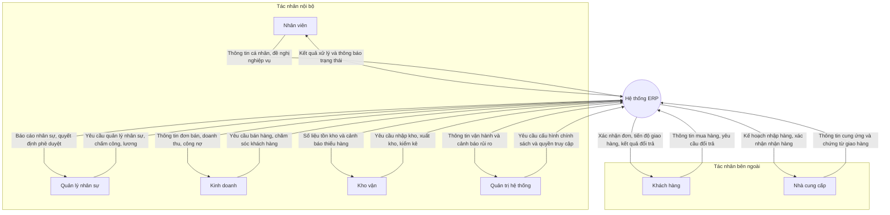
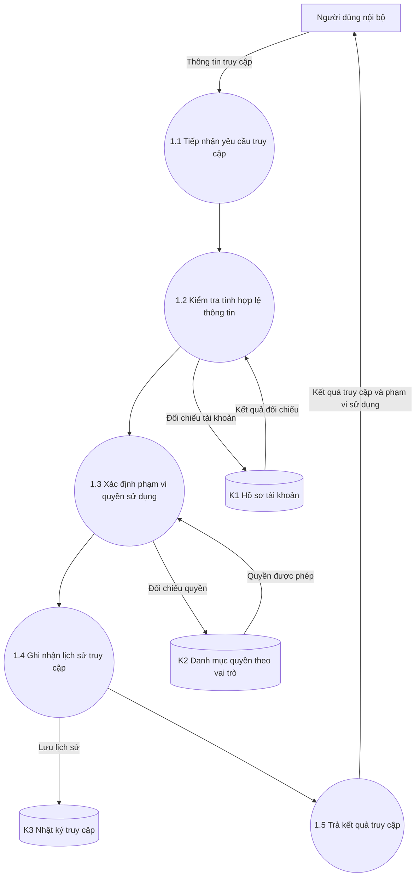
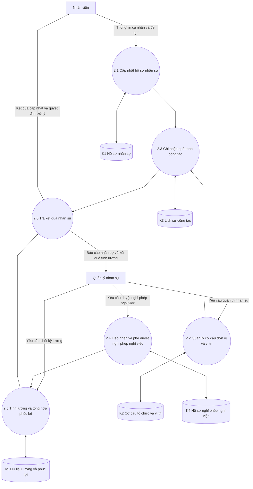
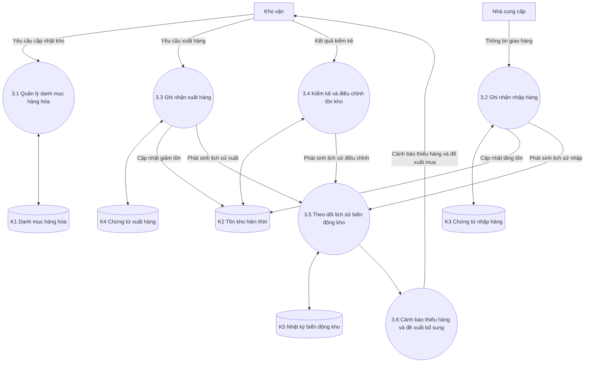
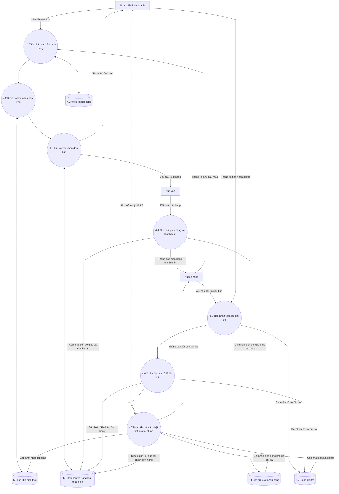
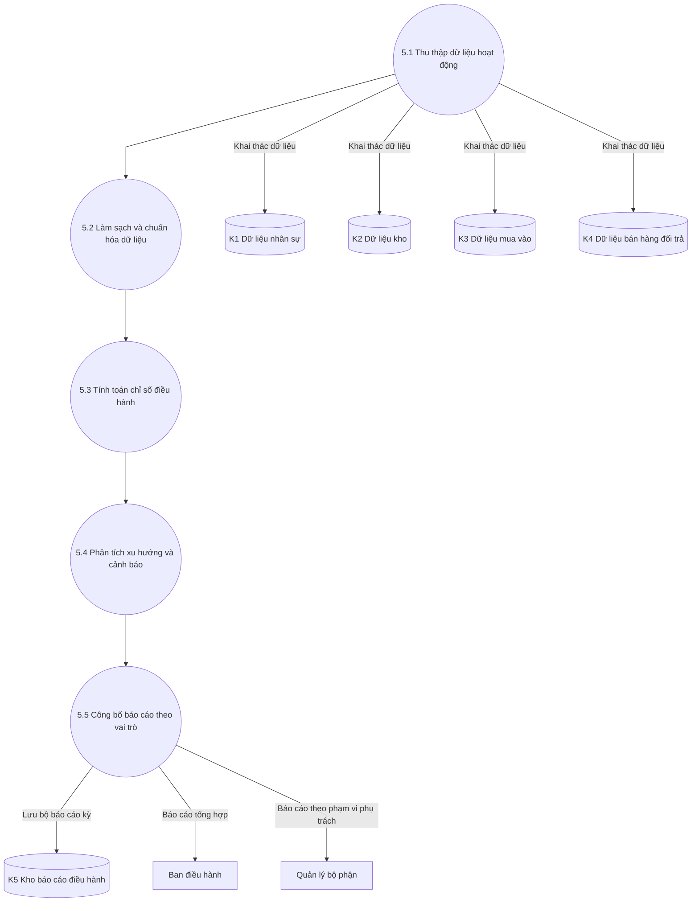
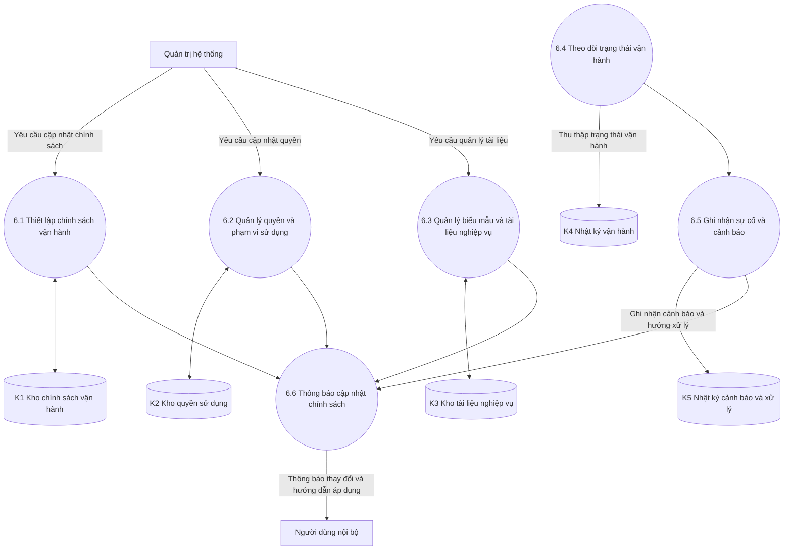

# Sơ đồ phân tích nghiệp vụ hệ thống ERP

Tài liệu này mô tả hệ thống ở mức phân tích nghiệp vụ, tập trung vào chức năng và luồng dữ liệu, không đi vào chi tiết kỹ thuật triển khai.

## 1) Sơ đồ chức năng (BFD)

```mermaid
%%{init: {"flowchart": {"nodeSpacing": 60, "rankSpacing": 75, "curve": "basis"}} }%%
flowchart TB
    L0[Hệ thống quản trị doanh nghiệp]

    L0 --> F1[Quản lý truy cập và phân quyền]
    L0 --> F2[Quản lý nhân sự]
    L0 --> F3[Quản lý hàng hóa và kho]
    L0 --> F4[Xử lý mua vào và nhập kho]
    L0 --> F5[Xử lý bán hàng và chăm sóc khách hàng]
    L0 --> F6[Xử lý đổi trả]
    L0 --> F7[Điều hành và báo cáo]
    L0 --> F8[Quản trị vận hành hệ thống]

    F1 --> F11[Tiếp nhận đăng nhập]
    F1 --> F12[Quản lý tài khoản sử dụng]
    F1 --> F13[Thiết lập quyền theo vai trò]

    F2 --> F21[Quản lý hồ sơ nhân sự]
    F2 --> F22[Quản lý cơ cấu tổ chức]
    F2 --> F23[Theo dõi biến động công việc]
    F2 --> F24[Xử lý nghỉ phép và nghỉ việc]
    F2 --> F25[Tính lương và phúc lợi]

    F3 --> F31[Quản lý danh mục hàng hóa]
    F3 --> F32[Theo dõi tồn kho]
    F3 --> F33[Theo dõi lịch sử xuất nhập tồn]
    F3 --> F34[Quản lý kho và vị trí lưu trữ]

    F4 --> F41[Quản lý nhà cung cấp]
    F4 --> F42[Lập và duyệt chứng từ nhập]
    F4 --> F43[Cập nhật số lượng sau nhập]

    F5 --> F51[Quản lý thông tin khách hàng]
    F5 --> F52[Lập và theo dõi đơn bán]
    F5 --> F53[Xác nhận giao hàng và thanh toán]

    F6 --> F61[Tiếp nhận yêu cầu đổi trả]
    F6 --> F62[Thẩm định điều kiện đổi trả]
    F6 --> F63[Hoàn tiền hoặc bù trừ và hoàn kho]

    F7 --> F71[Tổng hợp số liệu điều hành]
    F7 --> F72[Phân tích hiệu quả kinh doanh]
    F7 --> F73[Phân tích nhân sự và năng suất]

    F8 --> F81[Thiết lập chính sách vận hành]
    F8 --> F82[Quản lý tài liệu nghiệp vụ]
    F8 --> F83[Giám sát trạng thái hệ thống]
```

## 2) Sơ đồ ngữ cảnh (Context Diagram)

## 3) Sơ đồ luồng dữ liệu (DFD) mức đỉnh (Level 0)

```mermaid
%%{init: {"flowchart": {"nodeSpacing": 85, "rankSpacing": 100, "curve": "linear"}} }%%
flowchart TB
    subgraph TACNHAN[Tác nhân]
        E1[Người dùng nội bộ]
        E2[Khách hàng]
        E3[Nhà cung cấp]
    end

    subgraph TIENTRINH[Các tiến trình chính]
        P1((1.0 Quản lý truy cập))
        P2((2.0 Quản lý nhân sự))
        P3((3.0 Quản lý hàng hóa và kho))
        P4((4.0 Quản lý bán hàng và đổi trả))
        P5((5.0 Tổng hợp báo cáo điều hành))
        P6((6.0 Quản trị chính sách hệ thống))
    end

    subgraph KHO[Kho dữ liệu nghiệp vụ]
        D1[(D1 Hồ sơ tài khoản và phân quyền)]
        D2[(D2 Hồ sơ nhân sự và cơ cấu tổ chức)]
        D3[(D3 Dữ liệu công việc, nghỉ phép, tiền lương)]
        D4[(D4 Danh mục hàng hóa và số liệu tồn kho)]
        D5[(D5 Giao dịch mua vào và nhập kho)]
        D6[(D6 Giao dịch bán hàng và đổi trả)]
        D7[(D7 Chính sách vận hành và tài liệu)]
    end

    E1 -->|Yêu cầu đăng nhập và tác nghiệp| P1
    E1 -->|Yêu cầu quản lý nhân sự| P2
    E1 -->|Yêu cầu quản lý hàng hóa kho| P3
    E1 -->|Yêu cầu xử lý bán hàng đổi trả| P4
    E1 -->|Yêu cầu phân tích và theo dõi| P5
    E1 -->|Yêu cầu cấu hình vận hành| P6

    E2 -->|Đơn mua hàng và yêu cầu sau bán| P4
    E3 -->|Thông tin cung ứng hàng hóa| P3

    P1 <--> D1

    P2 <--> D2
    P2 <--> D3
    P2 -->|Đối chiếu quyền xử lý| D1

    P3 <--> D4
    P3 <--> D5

    P4 <--> D6
    P4 -->|Đối chiếu và cập nhật tồn kho| D4

    P5 -->|Khai thác dữ liệu tổng hợp| D2
    P5 -->|Khai thác dữ liệu tổng hợp| D3
    P5 -->|Khai thác dữ liệu tổng hợp| D4
    P5 -->|Khai thác dữ liệu tổng hợp| D5
    P5 -->|Khai thác dữ liệu tổng hợp| D6

    P6 <--> D7
    P6 -->|Cập nhật nguyên tắc phân quyền| D1

    P1 -->|Kết quả xác thực và quyền truy cập| E1
    P2 -->|Kết quả xử lý nhân sự| E1
    P3 -->|Kết quả xử lý kho và mua vào| E1
    P3 -->|Xác nhận kế hoạch nhận hàng| E3
    P4 -->|Kết quả bán hàng và đổi trả| E1
    P4 -->|Trạng thái đơn hàng và đổi trả| E2
    P5 -->|Báo cáo điều hành| E1
    P6 -->|Kết quả cấu hình vận hành| E1
```

## 4) Sơ đồ luồng dữ liệu (DFD) mức dưới đỉnh (Level 1)

Phần này phân rã đầy đủ các tiến trình chính ở mức đỉnh (1.0 đến 6.0) để thể hiện rõ các bước xử lý nghiệp vụ và luồng dữ liệu nội bộ.

### 4.1) Phân rã tiến trình 1.0 - Quản lý truy cập

### 4.2) Phân rã tiến trình 2.0 - Quản lý nhân sự

### 4.3) Phân rã tiến trình 3.0 - Quản lý hàng hóa và kho

### 4.4) Phân rã tiến trình 4.0 - Quản lý bán hàng và đổi trả

### 4.5) Phân rã tiến trình 5.0 - Tổng hợp báo cáo điều hành

### 4.6) Phân rã tiến trình 6.0 - Quản trị chính sách hệ thống

## Ghi chú

- Các sơ đồ được diễn đạt theo góc nhìn nghiệp vụ, dùng thuật ngữ dễ hiểu với người không chuyên kỹ thuật.
- DFD mức đỉnh thể hiện bức tranh tổng thể giữa tác nhân, tiến trình và kho dữ liệu.
- DFD mức dưới đỉnh phân rã chi tiết một tiến trình trọng yếu để làm rõ luồng dữ liệu nội bộ.
