# ERP Backend – Database Schema

## Mermaid ER Diagram

```mermaid
erDiagram

    %% ===================== AUTH & USERS =====================
    users {
        uuid id PK
        varchar username UK
        varchar email
        varchar password_hash
        varchar role_code FK
        boolean isActive
        enum status
        timestamp last_login
        timestamp created_at
        timestamp updated_at
    }

    roles {
        varchar role_code PK
        varchar role_name
        boolean isActive
        timestamp createdAt
        timestamp updatedAt
    }

    permissions {
        varchar permission_code PK
        varchar permission_name
        varchar type
        boolean isActive
        timestamp created_at
        timestamp updated_at
    }

    role_permissions {
        varchar role_code FK
        varchar permission_code FK
    }

    %% ===================== HR =====================
    employees {
        uuid id PK
        uuid user_id FK
        varchar employee_code UK
        varchar full_name
        enum gender
        varchar photo
        date date_of_birth
        varchar identity_number
        date identity_issued_date
        varchar identity_issued_place
        varchar nationality
        varchar phone
        varchar address_permanent
        varchar address_current
        varchar cv_url
        date start_date
        enum level
        uuid department_id FK
        uuid current_position_id FK
        enum status
        int totalAnnualLeave
        float usedAnnualLeave
        timestamp created_at
        timestamp updated_at
    }

    departments {
        uuid id PK
        varchar name UK
        text description
        boolean isDeleted
        timestamp created_at
        timestamp updated_at
        timestamp deleted_at
    }

    positions {
        uuid id PK
        varchar name UK
        text description
        decimal base_salary
        boolean isDeleted
        timestamp created_at
        timestamp updated_at
        timestamp deleted_at
    }

    job_histories {
        uuid id PK
        uuid employee_id FK
        uuid position_id FK
        uuid department_id FK
        date start_date
        date end_date
        decimal salary_at_time
        text note
        boolean is_current
        timestamp created_at
    }

    leave_requests {
        uuid id PK
        uuid employee_id FK
        date start_date
        date end_date
        decimal duration
        enum type
        text reason
        text rejection_reason
        enum status
        uuid approver_id FK
        timestamp created_at
        timestamp updated_at
    }

    resignation_requests {
        uuid id PK
        uuid employee_id FK
        uuid approver_id FK
        date submitDate
        date desiredLastDay
        date approvedLastDay
        text reason
        text handoverNote
        enum status
        text hrNote
        timestamp createdAt
        timestamp updatedAt
    }

    payslips {
        uuid id PK
        uuid employee_id FK
        int month
        int year
        decimal base_salary
        decimal standard_work_days
        decimal actual_work_days
        int unpaid_leave_days
        decimal final_salary
        jsonb details
        boolean is_paid
        text note
        timestamp created_at
    }

    salary_components {
        int id PK
        varchar name
        varchar code UK
        enum type
        boolean isSystem
    }

    holidays {
        int id PK
        date date
        varchar name
        text description
    }

    %% ===================== PRODUCTS =====================
    products {
        uuid id PK
        varchar sku
        varchar name
        uuid category_id FK
        uuid brand_id FK
        decimal sale_price
        int stock_quantity
        varchar warranty_months
        boolean hasSerialNumber
        jsonb specifications
        text thumbnailUrl
        boolean is_active
        timestamp created_at
        timestamp updated_at
    }

    brands {
        uuid id PK
        varchar name UK
        boolean is_active
        timestamp created_at
        timestamp updated_at
    }

    categories {
        uuid id PK
        varchar name UK
        uuid parent_id FK
        boolean is_active
        timestamp created_at
        timestamp updated_at
    }

    %% ===================== INVENTORY =====================
    product_serials {
        varchar serial_number PK
        enum status
        uuid product_id FK
        uuid warehouse_id FK
        uuid import_receipt_id FK
        uuid order_id FK
        timestamp created_at
        timestamp updated_at
    }

    product_stocks {
        uuid id PK
        uuid product_id FK
        uuid warehouse_id FK
        int quantity
        int minStockLevel
        timestamp lastUpdated
    }

    stock_histories {
        uuid id PK
        uuid product_id FK
        uuid warehouse_id FK
        enum type
        int change_amount
        int balance_after
        varchar reference_code
        varchar reason
        uuid performer_id FK
        timestamp created_at
    }

    warehouses {
        uuid id PK
        varchar code
        varchar name UK
        varchar address
        enum type
        uuid manager_id FK
        boolean is_active
        timestamp created_at
        timestamp updated_at
    }

    suppliers {
        uuid id PK
        varchar name UK
        varchar contact_phone
        varchar address
        boolean is_active
        timestamp created_at
        timestamp updated_at
    }

    import_receipts {
        uuid id PK
        varchar code UK
        uuid warehouse_id FK
        uuid supplier_id FK
        uuid created_by FK
        decimal total_price
        varchar note
        enum status
        boolean is_active
        timestamp created_at
        timestamp updated_at
    }

    import_details {
        uuid id PK
        uuid receipt_id FK
        uuid product_id FK
        int quantity
        decimal unitPrice
        decimal amount
        jsonb scannedSerials
    }

    %% ===================== SALES =====================
    customers {
        uuid id PK
        varchar fullName
        varchar phoneNumber UK
        varchar email UK
        text address
        enum tier
        decimal totalSpent
        int rewardPoints
        text note
        boolean isActive
        timestamp createdAt
        timestamp updatedAt
    }

    orders {
        uuid id PK
        varchar code UK
        uuid customer_id FK
        uuid creator_id FK
        decimal discount_amount
        decimal total_amount
        enum status
        varchar shipping_provider
        varchar shipping_address
        varchar tracking_code
        varchar note
        timestamp created_at
        timestamp updated_at
    }

    order_details {
        uuid id PK
        uuid order_id FK
        uuid product_id FK
        int quantity
        decimal unit_price
        decimal amount
        jsonb assignedSerials
    }

    return_requests {
        uuid id PK
        varchar code UK
        uuid order_id FK
        uuid customer_id FK
        uuid warehouse_id FK
        uuid creator_id FK
        enum status
        decimal refundAmount
        varchar reason
        timestamp createdAt
    }

    return_items {
        uuid id PK
        uuid return_request_id FK
        uuid product_id FK
        int quantity
        decimal refundPrice
        jsonb returnedSerials
    }

    %% ===================== SYSTEM =====================
    attachments {
        uuid id PK
        varchar original_name
        varchar path UK
        varchar mime_type
        bigint size
        enum type
        enum folder
        enum status
        varchar entity_type
        uuid entity_id
        uuid uploaded_by FK
        timestamp created_at
        timestamp updated_at
        timestamp deleted_at
    }

    system_settings {
        varchar key PK
        varchar value
        varchar description
        boolean isActive
    }

    %% ===================== RELATIONSHIPS =====================

    users }o--|| roles : "belongs to (role_code)"
    roles }|--|{ permissions : "role_permissions"
    users ||--o| employees : "has profile (user_id)"

    employees }o--|| departments : "works in (department_id)"
    employees }o--|| positions : "holds (current_position_id)"
    employees ||--o{ job_histories : "historyOf"
    employees ||--o{ leave_requests : "submits"
    employees ||--o{ resignation_requests : "submits"
    employees ||--o{ payslips : "receives"

    users ||--o{ leave_requests : "approves (approver_id)"
    users ||--o{ resignation_requests : "approves (approver_id)"

    job_histories }o--|| positions : "at position"
    job_histories }o--|| departments : "at department"

    warehouses }o--o| employees : "managed by (manager_id)"

    products }o--|| categories : "categorized (category_id)"
    products }o--|| brands : "branded (brand_id)"
    categories }o--o| categories : "parent (parent_id)"

    products ||--o{ product_serials : "has serials"
    products ||--o{ product_stocks : "stocked in"
    products ||--o{ stock_histories : "has log"

    product_serials }o--|| warehouses : "stored in"
    product_stocks }o--|| warehouses : "in warehouse"
    stock_histories }o--|| warehouses : "in warehouse"
    stock_histories }o--o| users : "performed by"

    warehouses ||--o{ import_receipts : "receives"
    import_receipts }o--o| suppliers : "from supplier"
    import_receipts }o--|| users : "created by"
    import_receipts ||--o{ import_details : "contains"
    import_details }o--|| products : "for product"

    customers ||--o{ orders : "places"
    orders }o--|| users : "created by"
    orders ||--o{ order_details : "contains"
    order_details }o--|| products : "for product"

    return_requests }o--|| orders : "for order"
    return_requests }o--|| customers : "by customer"
    return_requests }o--|| warehouses : "returned to"
    return_requests }o--|| users : "created by"
    return_requests ||--o{ return_items : "contains"
    return_items }o--|| products : "for product"

    attachments }o--o| users : "uploaded by"
```

---

## Mô tả Chi Tiết Các Bảng Dữ Liệu

---

### NHÓM 1 – QUẢN LÝ TÀI KHOẢN & PHÂN QUYỀN

---

#### Bảng `users` – Tài khoản người dùng

Lưu thông tin đăng nhập và xác thực của tất cả người dùng trong hệ thống.

| Cột | Kiểu | Mô tả |
|-----|------|-------|
| `id` | UUID (PK) | Định danh duy nhất |
| `username` | VARCHAR (UNIQUE) | Tên đăng nhập |
| `email` | VARCHAR | Địa chỉ email |
| `password_hash` | VARCHAR | Mật khẩu đã hash (bcrypt) |
| `role_code` | VARCHAR (FK → roles) | Vai trò của tài khoản |
| `isActive` | BOOLEAN | Tài khoản có đang hoạt động không |
| `status` | ENUM (ACTIVE, INACTIVE, LOCKED) | Trạng thái tài khoản |
| `last_login` | TIMESTAMP | Thời điểm đăng nhập gần nhất |
| `created_at` | TIMESTAMP | Ngày tạo |
| `updated_at` | TIMESTAMP | Ngày cập nhật gần nhất |

**Quan hệ:**
- Nhiều `users` thuộc một `roles` (N:1)
- Một `users` liên kết tới một `employees` (1:1)
- Một `users` có thể duyệt nhiều `leave_requests` và `resignation_requests`

---

#### Bảng `roles` – Vai trò

Định nghĩa các vai trò trong hệ thống (ADMIN, HR, SALES, WAREHOUSE, ...).

| Cột | Kiểu | Mô tả |
|-----|------|-------|
| `role_code` | VARCHAR (PK) | Mã vai trò (VD: ADMIN, HR_MANAGER) |
| `role_name` | VARCHAR | Tên hiển thị của vai trò |
| `isActive` | BOOLEAN | Vai trò có đang kích hoạt không |
| `createdAt` | TIMESTAMP | Ngày tạo |
| `updatedAt` | TIMESTAMP | Ngày cập nhật |

**Quan hệ:**
- Một `roles` có nhiều `users` (1:N)
- Một `roles` có nhiều `permissions` qua bảng trung gian `role_permissions` (N:N)

---

#### Bảng `permissions` – Quyền hạn

Các quyền hạn chi tiết trong hệ thống (VD: `READ_EMPLOYEE`, `APPROVE_LEAVE`).

| Cột | Kiểu | Mô tả |
|-----|------|-------|
| `permission_code` | VARCHAR (PK) | Mã quyền (VD: APPROVE_PAYSLIP) |
| `permission_name` | VARCHAR | Tên hiển thị của quyền |
| `type` | VARCHAR | Nhóm quyền (VD: HR, SALES, WAREHOUSE) |
| `isActive` | BOOLEAN | Quyền có đang hoạt động không |
| `created_at` | TIMESTAMP | Ngày tạo |
| `updated_at` | TIMESTAMP | Ngày cập nhật |

---

#### Bảng `role_permissions` – Phân quyền vai trò *(bảng trung gian)*

Bảng join N:N giữa `roles` và `permissions`.

| Cột | Kiểu | Mô tả |
|-----|------|-------|
| `role_code` | VARCHAR (FK → roles) | Mã vai trò |
| `permission_code` | VARCHAR (FK → permissions) | Mã quyền hạn |

---

### NHÓM 2 – QUẢN LÝ NHÂN SỰ (HR)

---

#### Bảng `employees` – Nhân viên

Lưu đầy đủ thông tin cá nhân và công việc của từng nhân viên.

| Cột | Kiểu | Mô tả |
|-----|------|-------|
| `id` | UUID (PK) | Định danh duy nhất |
| `user_id` | UUID (FK → users, nullable) | Tài khoản đăng nhập liên kết |
| `employee_code` | VARCHAR (UNIQUE) | Mã nhân viên nội bộ (VD: EMP-001) |
| `full_name` | VARCHAR | Họ và tên đầy đủ |
| `gender` | ENUM (MALE, FEMALE, OTHER) | Giới tính |
| `photo` | VARCHAR | Đường dẫn ảnh đại diện |
| `date_of_birth` | DATE | Ngày sinh |
| `identity_number` | VARCHAR | Số CCCD/CMND |
| `identity_issued_date` | DATE | Ngày cấp CCCD |
| `identity_issued_place` | VARCHAR | Nơi cấp CCCD |
| `nationality` | VARCHAR | Quốc tịch |
| `phone` | VARCHAR | Số điện thoại |
| `address_permanent` | VARCHAR | Địa chỉ thường trú |
| `address_current` | VARCHAR | Địa chỉ tạm trú |
| `cv_url` | VARCHAR | Link lưu trữ CV (Google Drive / S3) |
| `start_date` | DATE | Ngày bắt đầu làm việc |
| `level` | ENUM (JUNIOR, MIDDLE, SENIOR, LEAD) | Cấp bậc |
| `department_id` | UUID (FK → departments) | Phòng ban hiện tại |
| `current_position_id` | UUID (FK → positions) | Vị trí công việc hiện tại |
| `status` | ENUM (DRAFT, ACTIVE, ON_LEAVE, RESIGNED) | Trạng thái làm việc |
| `totalAnnualLeave` | INT | Tổng quỹ ngày phép trong năm (thường 12) |
| `usedAnnualLeave` | FLOAT | Số ngày phép đã sử dụng |
| `created_at` | TIMESTAMP | Ngày tạo hồ sơ |
| `updated_at` | TIMESTAMP | Ngày cập nhật |

---

#### Bảng `departments` – Phòng ban

| Cột | Kiểu | Mô tả |
|-----|------|-------|
| `id` | UUID (PK) | Định danh duy nhất |
| `name` | VARCHAR (UNIQUE) | Tên phòng ban (VD: Kinh doanh, Kỹ thuật) |
| `description` | TEXT | Mô tả phòng ban |
| `isDeleted` | BOOLEAN | Đã xóa mềm chưa |
| `created_at` | TIMESTAMP | Ngày tạo |
| `updated_at` | TIMESTAMP | Ngày cập nhật |
| `deleted_at` | TIMESTAMP | Ngày xóa mềm |

---

#### Bảng `positions` – Vị trí công việc

| Cột | Kiểu | Mô tả |
|-----|------|-------|
| `id` | UUID (PK) | Định danh duy nhất |
| `name` | VARCHAR (UNIQUE) | Tên vị trí (VD: Lập trình viên Backend, Nhân viên kinh doanh) |
| `description` | TEXT | Mô tả vị trí |
| `base_salary` | DECIMAL(10,2) | Mức lương cứng cơ bản của vị trí này |
| `isDeleted` | BOOLEAN | Đã xóa mềm chưa |
| `created_at` | TIMESTAMP | Ngày tạo |
| `updated_at` | TIMESTAMP | Ngày cập nhật |
| `deleted_at` | TIMESTAMP | Ngày xóa mềm |

---

#### Bảng `job_histories` – Lịch sử công tác

Ghi lại toàn bộ quá trình thay đổi vị trí / phòng ban / mức lương của nhân viên.

| Cột | Kiểu | Mô tả |
|-----|------|-------|
| `id` | UUID (PK) | Định danh duy nhất |
| `employee_id` | UUID (FK → employees) | Nhân viên |
| `position_id` | UUID (FK → positions) | Vị trí tại thời điểm đó |
| `department_id` | UUID (FK → departments) | Phòng ban tại thời điểm đó |
| `start_date` | DATE | Ngày bắt đầu giữ vị trí này |
| `end_date` | DATE (nullable) | Ngày kết thúc (null = đang hiện hành) |
| `salary_at_time` | DECIMAL(15,2) | Mức lương thực tế tại thời điểm đó |
| `note` | TEXT | Ghi chú (VD: thăng chức, điều chuyển) |
| `is_current` | BOOLEAN | Đây có phải bản ghi hiện hành không |
| `created_at` | TIMESTAMP | Ngày tạo |

---

#### Bảng `leave_requests` – Đơn xin nghỉ phép

| Cột | Kiểu | Mô tả |
|-----|------|-------|
| `id` | UUID (PK) | Định danh duy nhất |
| `employee_id` | UUID (FK → employees) | Nhân viên xin nghỉ |
| `start_date` | DATE | Ngày bắt đầu nghỉ |
| `end_date` | DATE | Ngày kết thúc nghỉ |
| `duration` | DECIMAL(4,1) | Số ngày nghỉ thực tế (đã loại T7/CN, cho phép 0.5 ngày) |
| `type` | ENUM (ANNUAL, UNPAID, SICK, OTHER) | Loại nghỉ |
| `reason` | TEXT | Lý do nghỉ |
| `rejection_reason` | TEXT | Lý do từ chối (nếu bị từ chối) |
| `status` | ENUM (PENDING, APPROVED, REJECTED, CANCELLED) | Trạng thái đơn |
| `approver_id` | UUID (FK → users, nullable) | Người duyệt |
| `created_at` | TIMESTAMP | Ngày nộp đơn |
| `updated_at` | TIMESTAMP | Ngày cập nhật |

---

#### Bảng `resignation_requests` – Đơn xin nghỉ việc

| Cột | Kiểu | Mô tả |
|-----|------|-------|
| `id` | UUID (PK) | Định danh duy nhất |
| `employee_id` | UUID (FK → employees) | Nhân viên nộp đơn |
| `approver_id` | UUID (FK → users, nullable) | Người HR duyệt |
| `submitDate` | DATE | Ngày nộp đơn |
| `desiredLastDay` | DATE | Ngày mong muốn nghỉ việc |
| `approvedLastDay` | DATE | Ngày HR chính thức chốt (quan trọng nhất) |
| `reason` | TEXT | Lý do nghỉ việc |
| `handoverNote` | TEXT | Link bàn giao công việc |
| `status` | ENUM (PENDING, APPROVED, REJECTED) | Trạng thái đơn |
| `hrNote` | TEXT | Ghi chú HR (Exit Interview feedback) |
| `createdAt` | TIMESTAMP | Ngày tạo |
| `updatedAt` | TIMESTAMP | Ngày cập nhật |

---

#### Bảng `payslips` – Phiếu lương

Lưu kết quả tính lương hàng tháng của từng nhân viên. Unique theo `(employee_id, month, year)`.

| Cột | Kiểu | Mô tả |
|-----|------|-------|
| `id` | UUID (PK) | Định danh duy nhất |
| `employee_id` | UUID (FK → employees) | Nhân viên |
| `month` | INT | Tháng tính lương |
| `year` | INT | Năm tính lương |
| `base_salary` | DECIMAL(10,2) | Lương cứng tại thời điểm tính |
| `standard_work_days` | DECIMAL(5,2) | Công chuẩn tháng đó (thường 26 ngày) |
| `actual_work_days` | DECIMAL(5,2) | Công thực tế = Chuẩn – Nghỉ không lương |
| `unpaid_leave_days` | INT | Số ngày nghỉ không lương |
| `final_salary` | DECIMAL(15,2) | Số tiền thực tế chuyển khoản |
| `details` | JSONB | Chi tiết các khoản (phụ cấp, bảo hiểm, thuế, thưởng...) |
| `is_paid` | BOOLEAN | Đã thanh toán chưa |
| `note` | TEXT | Ghi chú |
| `created_at` | TIMESTAMP | Ngày tạo phiếu |

---

#### Bảng `salary_components` – Cấu phần lương

Danh mục các khoản cộng/trừ vào lương (dùng làm key trong cột `details` của `payslips`).

| Cột | Kiểu | Mô tả |
|-----|------|-------|
| `id` | INT (PK) | Định danh |
| `name` | VARCHAR | Tên khoản (VD: Phụ cấp ăn trưa, BHXH) |
| `code` | VARCHAR (UNIQUE) | Mã code dùng làm key JSON (VD: LUNCH, BHXH) |
| `type` | ENUM (EARNING, DEDUCTION) | Khoản cộng (+) hay trừ (-) |
| `isSystem` | BOOLEAN | True = hệ thống tự tính, False = nhập tay |

---

#### Bảng `holidays` – Ngày lễ / Nghỉ lễ

Danh sách ngày nghỉ lễ trong năm dùng để tính công chuẩn và kiểm tra đơn phép.

| Cột | Kiểu | Mô tả |
|-----|------|-------|
| `id` | INT (PK) | Định danh |
| `date` | DATE | Ngày nghỉ lễ |
| `name` | VARCHAR | Tên ngày lễ (VD: Tết Nguyên Đán, Quốc Khánh) |
| `description` | TEXT | Mô tả thêm |

---

### NHÓM 3 – QUẢN LÝ SẢN PHẨM

---

#### Bảng `products` – Sản phẩm

| Cột | Kiểu | Mô tả |
|-----|------|-------|
| `id` | UUID (PK) | Định danh duy nhất |
| `sku` | VARCHAR | Mã SKU nội bộ (VD: CPU-INTEL-I9-14900K) |
| `name` | VARCHAR | Tên hiển thị sản phẩm |
| `category_id` | UUID (FK → categories) | Danh mục |
| `brand_id` | UUID (FK → brands) | Thương hiệu |
| `sale_price` | DECIMAL(12,2) | Giá bán lẻ niêm yết |
| `stock_quantity` | INT | Tổng tồn kho toàn hệ thống |
| `warranty_months` | VARCHAR | Thời hạn bảo hành (VD: "12 tháng") |
| `hasSerialNumber` | BOOLEAN | True = quản lý theo Serial (laptop, điện thoại) |
| `specifications` | JSONB | Thông số kỹ thuật động (RAM, CPU, màu sắc...) |
| `thumbnailUrl` | TEXT | Ảnh đại diện |
| `is_active` | BOOLEAN | Còn kinh doanh không |
| `created_at` | TIMESTAMP | Ngày tạo |
| `updated_at` | TIMESTAMP | Ngày cập nhật |

---

#### Bảng `brands` – Thương hiệu

| Cột | Kiểu | Mô tả |
|-----|------|-------|
| `id` | UUID (PK) | Định danh duy nhất |
| `name` | VARCHAR (UNIQUE) | Tên thương hiệu (VD: ASUS, Samsung, Intel) |
| `is_active` | BOOLEAN | Đang hoạt động |
| `created_at` | TIMESTAMP | Ngày tạo |
| `updated_at` | TIMESTAMP | Ngày cập nhật |

---

#### Bảng `categories` – Danh mục sản phẩm

Hỗ trợ cấu trúc phân cấp (cha – con) nhờ `parent_id` tự tham chiếu.

| Cột | Kiểu | Mô tả |
|-----|------|-------|
| `id` | UUID (PK) | Định danh duy nhất |
| `name` | VARCHAR (UNIQUE) | Tên danh mục (VD: Laptop Gaming, CPU) |
| `parent_id` | UUID (FK → categories, nullable) | Danh mục cha (null = danh mục gốc) |
| `is_active` | BOOLEAN | Đang hoạt động |
| `created_at` | TIMESTAMP | Ngày tạo |
| `updated_at` | TIMESTAMP | Ngày cập nhật |

---

### NHÓM 4 – QUẢN LÝ KHO & NHẬP HÀNG

---

#### Bảng `warehouses` – Kho hàng

| Cột | Kiểu | Mô tả |
|-----|------|-------|
| `id` | UUID (PK) | Định danh duy nhất |
| `code` | VARCHAR | Mã kho (VD: WH-HANOI-01) |
| `name` | VARCHAR (UNIQUE) | Tên kho |
| `address` | VARCHAR | Địa chỉ kho |
| `type` | ENUM (CENTRAL, BRANCH, DEFECTIVE) | Loại kho |
| `manager_id` | UUID (FK → employees, nullable) | Thủ kho phụ trách |
| `is_active` | BOOLEAN | Đang hoạt động |
| `created_at` | TIMESTAMP | Ngày tạo |
| `updated_at` | TIMESTAMP | Ngày cập nhật |

---

#### Bảng `suppliers` – Nhà cung cấp

| Cột | Kiểu | Mô tả |
|-----|------|-------|
| `id` | UUID (PK) | Định danh duy nhất |
| `name` | VARCHAR (UNIQUE) | Tên nhà cung cấp |
| `contact_phone` | VARCHAR | Số điện thoại liên hệ |
| `address` | VARCHAR | Địa chỉ nhà cung cấp |
| `is_active` | BOOLEAN | Đang hợp tác |
| `created_at` | TIMESTAMP | Ngày tạo |
| `updated_at` | TIMESTAMP | Ngày cập nhật |

---

#### Bảng `import_receipts` – Phiếu nhập hàng

Mỗi phiếu đại diện cho một lần nhập hàng từ nhà cung cấp vào kho.

| Cột | Kiểu | Mô tả |
|-----|------|-------|
| `id` | UUID (PK) | Định danh duy nhất |
| `code` | VARCHAR (UNIQUE) | Mã phiếu nhập (VD: PN-20260214-001) |
| `warehouse_id` | UUID (FK → warehouses) | Kho nhận hàng |
| `supplier_id` | UUID (FK → suppliers, nullable) | Nhà cung cấp |
| `created_by` | UUID (FK → users) | Nhân viên tạo phiếu |
| `total_price` | DECIMAL(15,2) | Tổng giá trị phiếu nhập |
| `note` | VARCHAR | Ghi chú |
| `status` | ENUM (PENDING, COMPLETED, CANCELLED) | Trạng thái phiếu |
| `is_active` | BOOLEAN | Còn hiệu lực |
| `created_at` | TIMESTAMP | Ngày tạo |
| `updated_at` | TIMESTAMP | Ngày cập nhật |

---

#### Bảng `import_details` – Chi tiết phiếu nhập

Mỗi dòng là một sản phẩm trong phiếu nhập.

| Cột | Kiểu | Mô tả |
|-----|------|-------|
| `id` | UUID (PK) | Định danh duy nhất |
| `receipt_id` | UUID (FK → import_receipts) | Phiếu nhập cha |
| `product_id` | UUID (FK → products) | Sản phẩm |
| `quantity` | INT | Số lượng nhập |
| `unitPrice` | DECIMAL(15,2) | Giá nhập (cost price) |
| `amount` | DECIMAL(15,2) | Thành tiền = quantity × unitPrice |
| `scannedSerials` | JSONB | Danh sách Serial vừa quét; sẽ đẩy sang `product_serials` khi COMPLETED |

---

#### Bảng `product_serials` – Số serial sản phẩm

Quản lý từng máy/thiết bị cụ thể theo số serial. Chỉ áp dụng cho sản phẩm có `hasSerialNumber = true`.

| Cột | Kiểu | Mô tả |
|-----|------|-------|
| `serial_number` | VARCHAR (PK) | Số serial (mã duy nhất từng thiết bị) |
| `status` | ENUM (AVAILABLE, SOLD, RETURNED, DEFECTIVE) | Trạng thái hiện tại |
| `product_id` | UUID (FK → products) | Sản phẩm thuộc về |
| `warehouse_id` | UUID (FK → warehouses) | Đang ở kho nào |
| `import_receipt_id` | UUID (FK → import_receipts, nullable) | Nhập từ phiếu nào |
| `order_id` | UUID (FK → orders, nullable) | Đã bán theo đơn hàng nào |
| `created_at` | TIMESTAMP | Ngày nhập kho |
| `updated_at` | TIMESTAMP | Ngày cập nhật trạng thái |

---

#### Bảng `product_stocks` – Tồn kho theo kho

Mỗi dòng = một sản phẩm tại một kho cụ thể. Unique theo `(product_id, warehouse_id)`.

| Cột | Kiểu | Mô tả |
|-----|------|-------|
| `id` | UUID (PK) | Định danh |
| `product_id` | UUID (FK → products) | Sản phẩm |
| `warehouse_id` | UUID (FK → warehouses) | Kho |
| `quantity` | INT | Số lượng tồn hiện tại |
| `minStockLevel` | INT | Mức tồn tối thiểu (cảnh báo khi xuống dưới mức này) |
| `lastUpdated` | TIMESTAMP | Thời điểm cập nhật gần nhất |

---

#### Bảng `stock_histories` – Lịch sử biến động kho

Log mọi sự kiện nhập/xuất/điều chỉnh tồn kho.

| Cột | Kiểu | Mô tả |
|-----|------|-------|
| `id` | UUID (PK) | Định danh |
| `product_id` | UUID (FK → products) | Sản phẩm |
| `warehouse_id` | UUID (FK → warehouses) | Kho |
| `type` | ENUM (IMPORT, EXPORT, ADJUSTMENT, RETURN) | Loại biến động |
| `change_amount` | INT | Số lượng thay đổi (+10 hoặc -5) |
| `balance_after` | INT | Số dư tồn kho sau khi thay đổi |
| `reference_code` | VARCHAR | Mã tham chiếu (mã đơn hàng, mã phiếu nhập) |
| `reason` | VARCHAR | Lý do thay đổi |
| `performer_id` | UUID (FK → users, nullable) | Nhân viên thực hiện |
| `created_at` | TIMESTAMP | Thời điểm xảy ra |

---

### NHÓM 5 – QUẢN LÝ BÁN HÀNG

---

#### Bảng `customers` – Khách hàng

| Cột | Kiểu | Mô tả |
|-----|------|-------|
| `id` | UUID (PK) | Định danh duy nhất |
| `fullName` | VARCHAR | Họ tên |
| `phoneNumber` | VARCHAR (UNIQUE) | Số điện thoại (key tra cứu bảo hành) |
| `email` | VARCHAR (UNIQUE, nullable) | Email |
| `address` | TEXT | Địa chỉ |
| `tier` | ENUM (STANDARD, SILVER, GOLD, VIP) | Hạng khách hàng |
| `totalSpent` | DECIMAL(15,2) | Tổng tiền đã chi tiêu (cộng dồn khi COMPLETED) |
| `rewardPoints` | INT | Điểm tích lũy |
| `note` | TEXT | Ghi chú của sale |
| `isActive` | BOOLEAN | Đang hoạt động |
| `createdAt` | TIMESTAMP | Ngày tạo |
| `updatedAt` | TIMESTAMP | Ngày cập nhật |

---

#### Bảng `orders` – Đơn hàng

| Cột | Kiểu | Mô tả |
|-----|------|-------|
| `id` | UUID (PK) | Định danh duy nhất |
| `code` | VARCHAR (UNIQUE) | Mã đơn hàng |
| `customer_id` | UUID (FK → customers) | Khách hàng |
| `creator_id` | UUID (FK → users) | Nhân viên tạo đơn |
| `discount_amount` | DECIMAL(15,2) | Chiết khấu tổng đơn |
| `total_amount` | DECIMAL(15,2) | Tổng giá trị đơn hàng |
| `status` | ENUM (PENDING, CONFIRMED, SHIPPING, COMPLETED, CANCELLED) | Trạng thái đơn |
| `shipping_provider` | VARCHAR | Đơn vị vận chuyển |
| `shipping_address` | VARCHAR | Địa chỉ giao hàng |
| `tracking_code` | VARCHAR | Mã vận đơn |
| `note` | VARCHAR | Ghi chú đơn hàng |
| `created_at` | TIMESTAMP | Ngày đặt hàng |
| `updated_at` | TIMESTAMP | Ngày cập nhật |

---

#### Bảng `order_details` – Chi tiết đơn hàng

Mỗi dòng là một sản phẩm trong đơn hàng.

| Cột | Kiểu | Mô tả |
|-----|------|-------|
| `id` | UUID (PK) | Định danh |
| `order_id` | UUID (FK → orders) | Đơn hàng cha |
| `product_id` | UUID (FK → products) | Sản phẩm |
| `quantity` | INT | Số lượng |
| `unit_price` | DECIMAL(15,2) | Đơn giá tại thời điểm bán |
| `amount` | DECIMAL(15,2) | Thành tiền = quantity × unit_price |
| `assignedSerials` | JSONB | Mảng mã Serial cụ thể đã xuất cho đơn này |

---

#### Bảng `return_requests` – Yêu cầu trả hàng / Đổi trả (RMA)

| Cột | Kiểu | Mô tả |
|-----|------|-------|
| `id` | UUID (PK) | Định danh |
| `code` | VARCHAR (UNIQUE) | Mã RMA (VD: RMA-20260221-001) |
| `order_id` | UUID (FK → orders) | Đơn hàng gốc |
| `customer_id` | UUID (FK → customers) | Khách hàng |
| `warehouse_id` | UUID (FK → warehouses) | Kho nhận hàng trả về |
| `creator_id` | UUID (FK → users) | Nhân viên tiếp nhận |
| `status` | ENUM (PENDING, COMPLETED, REJECTED) | Trạng thái |
| `refundAmount` | DECIMAL(15,2) | Tổng tiền hoàn trả cho khách |
| `reason` | VARCHAR | Lý do trả (VD: "Màn hình bị điểm chết") |
| `createdAt` | TIMESTAMP | Ngày tiếp nhận |

---

#### Bảng `return_items` – Chi tiết sản phẩm trả

Mỗi dòng là một sản phẩm trong yêu cầu trả hàng.

| Cột | Kiểu | Mô tả |
|-----|------|-------|
| `id` | UUID (PK) | Định danh |
| `return_request_id` | UUID (FK → return_requests) | Yêu cầu trả hàng cha |
| `product_id` | UUID (FK → products) | Sản phẩm |
| `quantity` | INT | Số lượng trả |
| `refundPrice` | DECIMAL(15,2) | Tiền hoàn lại cho sản phẩm này |
| `returnedSerials` | JSONB | Mảng các mã Serial cụ thể khách mang trả |

---

### NHÓM 6 – HỆ THỐNG

---

#### Bảng `attachments` – File đính kèm

Quản lý tập trung tất cả file upload (ảnh sản phẩm, CV nhân viên, ...).

| Cột | Kiểu | Mô tả |
|-----|------|-------|
| `id` | UUID (PK) | Định danh |
| `original_name` | VARCHAR | Tên file gốc khi upload |
| `path` | VARCHAR (UNIQUE) | Đường dẫn trong storage |
| `mime_type` | VARCHAR | MIME type (image/jpeg, application/pdf...) |
| `size` | BIGINT | Kích thước file (bytes) |
| `type` | ENUM (IMAGE, PDF, VIDEO, OTHER) | Loại file |
| `folder` | ENUM (PRODUCTS, EMPLOYEES, ORDERS, TEMP) | Thư mục lưu trữ |
| `status` | ENUM (ACTIVE, DELETED) | Trạng thái |
| `entity_type` | VARCHAR | Loại entity liên kết (product, employee, order...) |
| `entity_id` | UUID | ID của entity liên kết |
| `uploaded_by` | UUID (FK → users, nullable) | Người upload |
| `created_at` | TIMESTAMP | Ngày upload |
| `updated_at` | TIMESTAMP | Ngày cập nhật |
| `deleted_at` | TIMESTAMP | Ngày xóa mềm |

---

#### Bảng `system_settings` – Cài đặt hệ thống

Lưu các tham số cấu hình toàn cục dạng key-value.

| Cột | Kiểu | Mô tả |
|-----|------|-------|
| `key` | VARCHAR (PK) | Khóa định danh (VD: GLOBAL_LUNCH_ALLOWANCE) |
| `value` | VARCHAR | Giá trị (lưu chuỗi, parse khi dùng) |
| `description` | VARCHAR | Mô tả ý nghĩa của cài đặt |
| `isActive` | BOOLEAN | Cài đặt này có đang áp dụng không |

---

## Tóm tắt số lượng bảng

| Nhóm | Số bảng |
|------|---------|
| Auth & Phân quyền | 4 (users, roles, permissions, role_permissions) |
| Quản lý nhân sự HR | 9 (employees, departments, positions, job_histories, leave_requests, resignation_requests, payslips, salary_components, holidays) |
| Sản phẩm | 3 (products, brands, categories) |
| Kho & Nhập hàng | 6 (warehouses, suppliers, import_receipts, import_details, product_serials, product_stocks) |
| Lịch sử kho | 1 (stock_histories) |
| Bán hàng | 5 (customers, orders, order_details, return_requests, return_items) |
| Hệ thống | 2 (attachments, system_settings) |
| **Tổng** | **30** |
